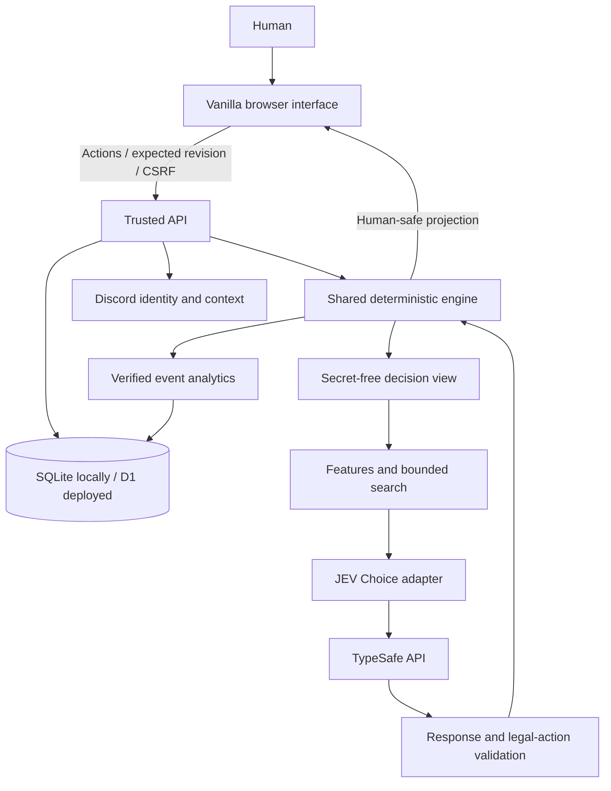
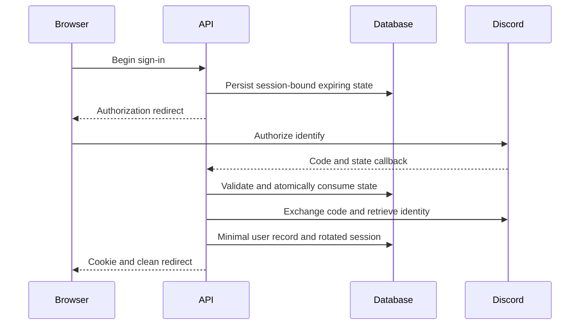
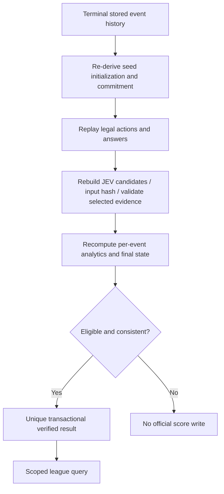

# Human vs JEV — Guess Who: implemented A–Z reference

This document describes the delivered code, not a promise that an external deployment or live-provider experiment has occurred. The supplied planning prompt is preserved in `source/original-requirements.md`. See `SOURCES.md` for the external documentation used for adapters. Intentional implementation choices extending the original plan are identified below.

## A. Game Interpretation

Two players use the same authored roster of 24 fictional characters. The trusted server independently assigns one secret to each player, uniformly; equal secrets are permitted. The server randomly chooses the starter. A turn consists of one informative yes/no trait question or one final guess. A correct guess wins; an incorrect guess loses immediately. A singleton candidate set still requires a subsequent guess. There are no ordinary draws.

Twelve predefined questions cover eight Boolean traits and four mutually exclusive hair colors. Automatic truthful answers, automatic elimination, preset questions and a random starter are explicit browser adaptations. They avoid ambiguous free-form questions and dishonest answers. Portrait descriptions enumerate the authoritative traits. The roster has unique question signatures, so distinct characters are distinguishable.

There are 24 × 24 × 2 = 1,152 initial secret/starter configurations. With at most twelve informative questions per actor, a match terminates by the 25th normal action at the latest. Server expiry or resignation can terminate it sooner. This state-count observation does not imply every competitive strategy has been solved.

## B. Player Experience

The page opens without an account. Select a difficulty and Practice, Casual or Ranked, then create a match. Practice uses the local deterministic policy and is labeled accordingly. Casual uses the provider when configured and otherwise an explicitly labeled fallback. Ranked creation requires Discord identity and configured, pinned JEV.

The human sees their own secret, the board of possible JEV secrets, public action history, and JEV's public deduction progress. Type a question in your own words to preview its split, or select a candidate to open a final-guess confirmation. The typed text is resolved in the browser to one of the 12 predicates (`public/shared/question-parse.js`) and never leaves the page: the ask action still carries a `predicateId` the server validates against `legalActions`, so the rules, the wire format and the finite candidate set the model chooses from are unchanged. A question that resolves to nothing, or to more than one predicate, is refused with the still-open questions offered. After each human action the browser advances JEV through a separate idempotent API operation. Reconnect resumes authoritative state. Match results expose the two secrets, analytics and export controls. An already loaded page can start unranked local practice if the API is unreachable.

The Analytics tab contains live action diagnostics and retained personal history; Leaderboards supplies World, Server and Channel views. Anonymous or local history never becomes an official result retroactively after sign-in.

## C. Game Rules Engine

`public/shared/rules.js` owns explicit state: rules/roster version, match ID, revision, phase, turn, secret IDs, per-actor candidate masks, question history/counters, turn counters and outcome. `createInitialState` receives explicit secrets and starter; it does not sample randomness. The engine is independent of DOM, clock, storage and network.

`getLegalActions` generates informative questions and remaining-character guesses. Human resignation is allowed on the human's turn. `applyAction` normalizes the action, validates legality, computes the answer against the other secret, intersects/subtracts the predicate mask, increments revision/counters and changes turn or outcome. `expire` is a separate lifecycle transition. `projectForHuman` withholds the other secret until terminal; `projectForDecision` withholds both secrets. `replay` reconstructs state from initialization and ordered actions.

Question information is computed from public candidate masks only. Neither rendered cards nor browser-provided outcomes are authoritative.

## D. JEV Decision Model

JEV selects from a finite candidate set; it never edits state. Exact counting, entropy, splits and bounded search run in ordinary JavaScript first. The adapter sends a redacted view and computed candidate evidence through TypeSafe Choice. A validated action is applied by the same engine used in tests and replays.

The local strategy module includes a greedy balanced-question policy, a deterministic fallback and bounded race-aware expectiminimax. Uniform priors follow from independent uniform secret assignment and truthful predicate answers. A question branch probability is its candidate fraction; a guess succeeds with probability 1/n. The search accounts for immediate loss on a wrong guess and alternates the actors' race objectives. At its frontier it uses completion-turn distributions under a fixed greedy, no-risk policy.

| Difficulty | Implemented decision representation |
|---|---|
| Easy | First four informative canonical questions in catalog order; singleton guess; reduced evidence |
| Normal | All canonical informative questions and singleton guess; question features |
| Hard | All canonical questions and remaining guesses; two-ply search, 5,000-node budget |
| JEV | Same broad action surface; iterative deepening up to six plies, 50,000-node budget |

Only completed iterations supply search estimates. These are policy- and budget-dependent estimates, not perfect-play certificates. The strongest intended configuration is not claimed empirically strongest without live benchmarks.

## E. JEV State Encoding

Action IDs are `ask:<predicate>` and `guess:<character>`. There are at most 36 raw actions before informative-question filtering and equivalent-partition pruning. Candidate records contain action, description, split counts, information gain, expected/worst remaining candidates and optional estimated race-win probability.

`server/jev.js` constructs `{model,state,questions:{action:{type:'choice',instructions,criteria}}}`. The model is pinned, initially `jev-1.13.0`. Validation requires the correct response model/type, exact option-key set, finite [0,1] probabilities with approximately unit sum, confidence in range, and a selected maximal-probability action. Exact probability ties use lexical ID ordering. A singleton action is recorded as `forced_rule` without a provider call.

Request evidence contains neither secret, seed, Discord identity nor user-controlled prose. The input hash identifies the canonical redacted request. Selection confidence is not outcome probability. Attempts, timing, usage availability and rejection reason are retained separately from accepted decisions.

## F. Architecture

The implementation supports Node's built-in HTTP/SQLite for immediate local use and Workers/D1 for a small deployment. Both use the same Web Request/Response application, rules and SQL store. Node SQLite is a local adapter, not a second independent backend. Seven tables are used; telemetry is the additional table justified by the user's expanded analytics request.

The static boundary is exactly `public/`. No WebSocket, queue, framework, cache server or long-running Discord gateway is necessary.

## G. Security Boundaries

All browser inputs, local storage, URLs, display names and provider outputs are untrusted. Server secrets, OAuth grants, identity, launch context, turn leases, initialization and result writes are privileged. Owner checks precede game/history/replay reads. Mutations require origin and CSRF checks. Sessions are HTTP-only, same-site cookies; HTTPS production cookies are Secure. SQL is parameterized and names use `textContent`.

Seed commitment prevents post-commit initialization changes, not a dishonest operator's initial biased sampling. It does not certify human play without outside assistance. See `SECURITY.md` for the trust diagram, checks, retention and unresolved operational responsibilities.

## H. Discord Authentication

Use authorization code with `identify` only. OAuth state is random, hashed, expiring, single-use and bound to the initiating session. The server exchanges the code, retrieves minimal identity, discards provider access/refresh tokens and rotates its own application session. Identity storage contains the Discord ID, display name, avatar reference and operational timestamps, not email.

No email, guild listing or message-reading scope is requested. Account access must be configured by the deployer; supplied test identities are mocks.

## I. Discord Context

A guild-installed `/play-jev game:guess-who` command provides a verified guild/channel/user tuple. The endpoint verifies Discord's Ed25519 signature over the original timestamp and body, checks freshness, app and guild-installation fields, then issues an ephemeral user-bound HMAC launch token. The browser uses a fragment to reduce accidental URL/referrer disclosure, strips it, signs in, and redeems it server-side. A one-time nonce prevents reuse.

Identity comes from OAuth. Guild/channel association comes from the signed interaction. Neither arbitrary URL IDs nor OAuth identify alone proves channel context. A fresh five-minute launch proof is required when starting another context-attributed ranked match or reading a private community board. The snapshot persists on the existing match. This is not continuous permission or membership monitoring.

## J. Scoring

Native outcome is win/loss. Counters include questions, turns, guesses, risks, streaks and starter, with transparent reason codes. Duration is diagnostic, not a tie-breaker. Ranked expiry after 24 hours is a loss unless the game has already been disqualified by fallback; browser disconnect does not immediately forfeit.

The ranking statistic is the lower Wilson bound for wins/games with z = 1.96, minimum twenty games in the selected period. Display W–L and ordinary win rate. This rule dampens a tiny lucky sample; it is not intrinsic human skill. Ties use wins, then stable identity. Statistics and rankings never merge incompatible rules/roster/model/policy versions as one competition.

## K. Leaderboards

World includes eligible results; Server and Channel additionally require matching stored launch attribution. Website-only results enter World only. Difficulty, week/all-retained and immutable league ID filter comparisons. Weeks begin Monday UTC, based on match creation time. Recent unfinished games can still affect a week's eventual result after expiration.

Queries aggregate/rank in SQL before pagination. Up to fifty entries are returned; cursors are signed, filter-bound and carry a fixed maximum result ID. Qualified players precede provisional players. Retention can shorten the visible all-retained period. An absolute lifetime archive is not promised. Blocked accounts are excluded.

## L. Data Model

The executable schema is `migrations/001.sql`, not a pseudocode migration. Tables are: `users` for minimal identity; `sessions` for hashed session tokens, CSRF and verified context; `grants` for OAuth/launch grants and single-use markers; `matches` for private initialization, state and bounded event JSON with CAS revision/lease; `results` for unique verified ranked summaries; `rate_limits` for persistent buckets; `telemetry` for allowlisted operational events.

Indexes cover owner history, active ranked matches, expiration, World/Server/Channel league queries and telemetry time. A unique ranked-active constraint prevents simultaneous reroll attempts. Official summaries deliberately survive detailed replay retention. The CAS update and guarded result insertion share one SQL transaction; a failed conditional update cannot accidentally award a result.

## M. API

`docs/API.md` defines every implemented request, response, status and boundary. Endpoints cover session/health, Discord auth/logout/interactions/context, game creation/read/action/advance/completed replay, personal analytics and leaderboard. There is no endpoint accepting a browser's claimed score, winner or authoritative secret.

Mutation IDs and expected revisions make retries safe. Responses distinguish stale state, conflict, unavailable configuration, illegal action and quota rejection. JEV advancement uses a persisted lease and can return pending instead of duplicating an inference. Canonical origin checking protects the local adapter from hostile Host/Origin assumptions.

## N. Anti-Cheat / Verification

A fresh 256-bit server seed drives domain-separated deterministic draws; rejection sampling maps uniformly to 24 characters. Publish a hash commitment over canonical configuration, match ID and seed, withhold the seed until terminal. The server evaluates all questions and guesses online, so live secrets cannot be read from a modified browser.

The result verifier checks frozen versions, chronological event order, state reconstruction, candidate evidence and metrics. It does not re-call inference. A locally edited replay may be internally self-consistent without being an authentic server-issued record; only an owner-authenticated server record establishes official provenance. Invalid/stale provider actions cannot mutate the authoritative game.

## O. Replay Format

Server replay JSON includes `formatVersion`, mode/config/league, creation/expiration/finish times, eligibility, initialization, revealed seed, commitment, terminal state and ordered events. Each event contains sequence, actor/action, answer/correctness as appropriate, timestamp, request ID, computed metrics and optional decision record. The latter holds source, model, candidate evidence, distribution, input hash, timing/search, attempts and usage availability.

`npm run verify -- reports/sample-replay.json` performs local consistency checking. Offline exports use an explicitly different unranked flag and only support rules/state reconstruction: no seed-commitment or authenticated-provider claim. Replay storage is owner-only; public sharing is deferred. Recorded actions are deterministic even though a fresh remote model call is not assumed reproducible.

## P. UI Layout

Desktop has a six-column board, question controls, own secret, JEV deduction preview, evidence panel, history and separate analytics/leaderboards tabs. Mobile uses four columns, own secret above the board, then controls and analysis. Guessing uses an explicit confirmation dialog. UI action controls are disabled outside the proper turn; errors do not erase the current match.

Semantic buttons, tab keyboard handling, visible focus, live status, text alternatives containing every trait, reduced-motion CSS and touch-sized controls are included. Original SVG portraits are generated from the roster rather than copied commercial art. The full-page Analytics view includes tables and a candidate-count trace; it does not expose hidden model reasoning.

## Q. File Structure

`public/shared/` isolates rules, roster, strategy and analytics. `server/` contains application, auth/context, store, match orchestration, security and provider adapter. `scripts/` contains local HTTP/SQLite, registration, replay, static checks and operator exports. `tests/` holds executable rules, analytics, security, provider, API and browser coverage. `benchmarks/` runs scripted or explicitly opted-in paid experiments. `docs/`, `reports/` and `source/` retain reference, actual evidence and original requirements separately.

There is no generalized plugin framework. The small shared engine is reusable by future games and platform auth/context concepts are separated without pretending all game logic is interchangeable.

## R. Dependencies

Runtime code has no npm package dependency. Node's HTTP/SQLite/Web APIs supply local execution. Workers/D1 supplies the hosted implementation of those server responsibilities. TypeSafe and Discord are optional external service dependencies until activated; browser-native APIs cannot securely replace their server credentials or identity attestations.

Wrangler is optional deployment tooling, not shipped frontend code. Python Playwright is optional browser-test tooling. Native Node tests need neither. All authored assets are local. `package-lock.json` records the zero-runtime-dependency package. This simplicity does not remove the need to operate, patch and configure the selected host.

## S. Tests

The delivered test suite covers all 1,152 initialization combinations, duplicate secrets, deterministic play/replay, legality, public projections, equivalent-observation redaction, search budgets, analytics formulas/nulls, CSV injection, provider schema/failure/timeout, OAuth state/signatures/rotation, context redemption, ownership, revisions, lease conflicts, result uniqueness, expiration, scope isolation and pagination. Operations tests cover retained exact-day cohorts, activity identity distinctions and attempts discarded from game state.

`reports/VALIDATION.md` records final executable counts. Mocked Discord/JEV responses exercise the integration contracts without claiming live accounts were used. Browser interaction tests support normal HTTP on a user's machine; this build's recorded run used an explicitly documented inline-asset/HTTP-bridge fixture due to environment navigation restrictions.

## T. JEV Benchmark Plan

`npm run benchmark` runs five scripted matchups, every secret pair and both starters: fixed order, random-safe, random-risk, balanced and bounded race-aware search. It writes match/decision CSVs, aggregate JSON, cohort statistics and a readable report. Reproducible seeded randomness is used only for scripted random policies; it is not authoritative production randomness.

Live runs require both a TypeSafe key and `--live --confirm-paid`. Options include limit, repetitions, difficulty, output directory and JEV-vs-JEV. Strict live outcomes exclude fallback games. Track starter sensitivity, wrong guesses, question quality, latency distribution, retries, invalid outputs, search estimates and known usage. Confidence remains a selection statistic. The included scripted benchmark is not proof of JEV performance or of optimal play.

## U. Deployment

Start locally with Node 22.13+ and `npm start`; this build was tested with 22.16.0. Local runtime and tests require no dependency install. Optional `.env` controls credentials and stable signing/hash secrets. The local server binds loopback by default and serves only `public/`.

For Workers, set the D1 database ID, custom HTTPS origin, secret bindings, migration and hourly maintenance schedule. Register OAuth callback and guild application command. See `DEPLOYMENT.md` for exact steps and uncompleted live release checks. No deployment account was accessed in creating this package.

## V. Implementation Phases

The delivered sequence is engine/roster → local strategy/UI → authoritative storage → JEV boundary → replay/metrics → Discord/context → scoped rankings → reliability/retention → expanded analytics → benchmark/browser checks → packaging. Files and executable tests exist for these stages; external-service provisioning and production smoke testing remain deployment tasks, not implicitly completed stages.

For subsequent changes, use small milestones: modify one rules/policy/schema unit, add a regression, rerun unit/API tests, regenerate sample and benchmark, inspect browser behavior, then review whether the change requires a new rules/roster/prompt/policy/analytics version or migration. Never silently reinterpret active matches under a changed ruleset.

## W. Risks and Open Questions

Live JEV strength and availability are unmeasured here. Remote response variability, roster presentation ambiguity, first-move advantage and budget-dependent estimates require evaluation. Discord context is launch-time, not continuous. Native SQLite warnings/host capabilities differ by runtime. This package has not undergone independent security review, load testing or a production Cloudflare trial.

Operational limitations include no hosted alert sink, no account-wide provider circuit breaker, no self-service deletion UI, and no automatic proof of human unaided play. Aggregate history and retention are bounded. Telemetry writes can fail, so operational usage is not a complete provider bill. Deployment owners must supply backups, deletion handling, incident response and budget alerts.

## X. Simplification Pass

Excluded: frameworks/build bundlers, UI kits, bot Gateway, WebSockets, queue/cache services, general-purpose game plugins, free-text question understanding, generated chatter, Elo, public replays, custom portraits, achievements, a service worker and marketing trackers.

Kept because they solve actual boundaries: trusted online turns protect secrets; a separate advance operation permits inference recovery; persisted CAS/leases prevent duplicate turns/results; telemetry supports the expanded analytics requirement; Node's local SQLite adapter makes the source directly runnable without cloud setup. Analytics is descriptive and exportable rather than an additional third-party analytics service.

## Y. MVP Definition

The delivered local system plays complete human-versus-local matches, with server authority, two boards, trait elimination, four decision configurations, diagnostics, history and replays. Configured JEV and Discord code paths exist with mocked integration coverage. A deployed ranked release is complete only after real identity, signed community launch, actual provider inference, verified result insertion and each scope have been exercised with the operator's own configured services.

The distinction matters: supplying deployable source is not deploying it. The included evidence identifies what actually ran.

## Z. Next Implementation Step

Run `npm test`, `npm run check`, then `npm start` after extraction. Verify a practice match and open Analytics. The next external-integration task is to copy `.env.example`, set a real TypeSafe API key and pinned model, and perform a small explicitly authorized casual/live benchmark before enabling ranking. Then configure and test Discord OAuth and signed context in staging. Preserve the redaction, deterministic replay, missing-data and fallback labels as non-negotiable regression checks.
