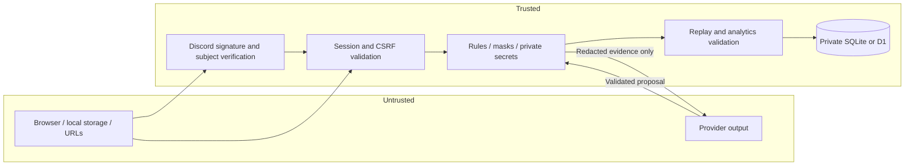

# Security model and review notes

## Boundaries

## Implemented controls

Live secrets and seeds are stored exclusively in the server's private match payload. The human projection contains only the human's own secret. The JEV projection omits both secrets and all identity/community data. A uniform high-entropy seed is committed before play. A plain unsalted hash of one of 24 secrets is never used as the public commitment.

Every mutation validates session, Origin and CSRF, except signed Discord interactions. Session cookies are HTTP-only, SameSite=Lax, Secure outside localhost development. OAuth state is random, hashed in storage, browser-session bound, expiring, and single-use. Successful OAuth rotates the session. Provider tokens are not persisted.

Discord interaction verification uses the timestamp concatenated with the exact raw body, Ed25519 signatures, timestamp freshness, application identity, guild installation owner, and invocation subject. Launch tokens expire, are signed, are bound to the invoking account, and are single-use. A unique consumption marker guards concurrent redemption so the losing request cannot mutate session context.

Queries are parameterized. Display names are rendered with textContent. No free-text input is passed into the JEV instructions. Browser CSP permits only local scripts/styles/assets and prohibits framing and objects. CSV exports quote data and neutralize formula-like strings.

Actions have strict fields, turn legality, revision checks and persisted idempotency keys. JEV turns use a persisted expiring lease. A unique commit token binds state updates to result insertion even when a D1 transaction's conditional update changes zero rows. A unique match-result constraint prevents duplicate awards.

A terminal replay recomputes initialization commitment, action order/answers, masks, outcome, counters and per-action analytics. Accepted live/forced JEV events also rederive the secret-free request and validate recorded decision evidence. File-based replay verification establishes internal consistency only, not server issuance.

Application quotas, bounded bodies, bounded inference attempts and a deterministic fallback limit obvious abuse. Fallback permanently removes ranking eligibility. Each inference attempt is also recorded operationally so discarded responses are not silently excluded from usage diagnostics.

## What remains a deployment responsibility

This package is not a penetration-test certificate. Live credential flows, actual provider availability, Cloudflare runtime behavior, external monitoring, backups and recovery need staging validation.

There is no continuous Discord membership/permission subscription; channel context is a five-minute launch-time proof. Existing games retain their creation-context attribution. Account/session identity does not prove a unique human. External solvers and coordinated account abuse are not prevented.

There is no automatic outage adjudication, production admin UI, spending-cap integration, cross-request provider circuit breaker, self-service account deletion, or long-term fraud model. Application-only quotas do not replace provider spending limits or edge abuse controls. Do not expose unrestricted anonymous paid inference without appropriate limits.

Detailed active-match payloads are sensitive database records. Database exports, backups, filesystem permissions, D1 access permissions and operational access must remain private. Source code and static assets are not secret; game integrity must not depend on obscuring them.

Do not reset production leagues or overwrite running-match rules without a migration/drain plan. Analytics changes can alter replay verification expectations, so retain the appropriate analytics/rules implementation for old stored records or explicitly migrate them.

## Focused release tests

The packaged tests exercise hidden-state projection, equivalent-observation invariance, malformed provider output, bounded timeout and retry, forged/stale OAuth state, signed-token tampering, concurrent launch redemption, ownership isolation, stale revisions, duplicate actions/results, fallback disqualification, expiry losses, and leaderboard context isolation.

Browser tests are Chromium DOM/interactions tests. The build environment required inline assets plus a Python HTTP bridge; native browser navigation and deployed security-header enforcement must be checked in staging. Server-side header/session checks were separately exercised through API tests.

## Reporting a problem

Keep a failing replay or minimal test case private when it contains a seed or secret. Share only completed authorized replay evidence. Include rule/roster/model/policy versions and the failing revision. Do not include API keys, OAuth credentials, live launch tokens, session cookies, or a raw production database.
